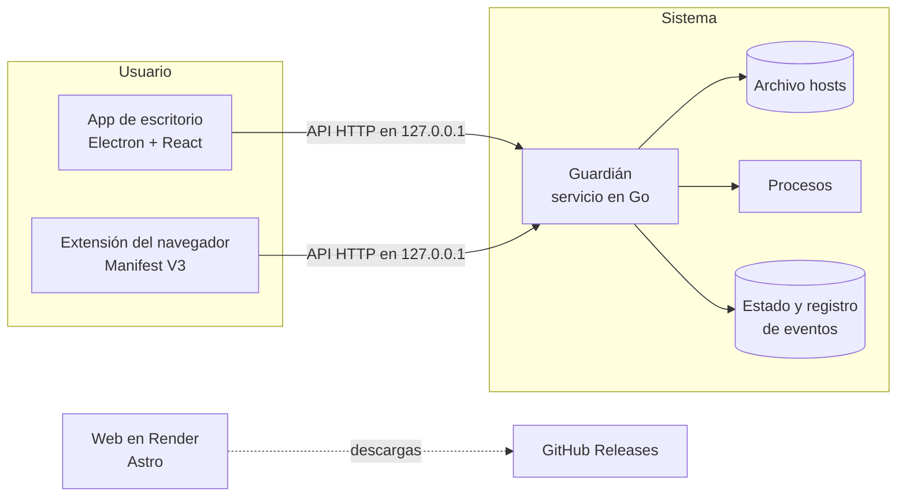

# Céntrate

**Escribe lo que no quieres hacer y Céntrate lo bloquea, aunque cierres la app.**

Céntrate es una app de escritorio gratuita y de código abierto para dejar de procrastinar. Escribes, por ejemplo, _«no veo YouTube en una hora»_ y la app lo bloquea durante ese tiempo. El bloqueo sigue aunque cierres la app, la mates desde el Administrador de tareas o reinicies el ordenador. Cada intento de entrar en algo bloqueado te cuesta puntos.

Además tiene un **Study Mode**: la cámara y una IA que funciona solo en tu ordenador comprueban si estás estudiando. Ninguna imagen sale de tu ordenador.

> Estado: en desarrollo (Fase 0). Mira [`ROADMAP.md`](ROADMAP.md).

## Qué puedes hacer

- **Bloquear escribiendo:** _«no veo YouTube en una hora»_, _«bloquea las redes sociales hasta las 20:30»_. Modos Normal, Estricto, Hardcore y Examen; un bloqueo se puede ampliar, nunca acortar.
- **Límites diarios:** _«YouTube máximo 30 minutos al día»_. Mientras te quede tiempo no se bloquea nada; cuando lo gastas, queda bloqueado hasta las 0:00. Bajar un límite es al momento; subirlo o quitarlo tarda 24 horas.
- **Horarios:** bloqueos que se repiten solos, como las redes sociales entre semana de 16:00 a 19:00.
- **Study Mode** con cámara (o sin ella), Pomodoro, sonidos, mini temporizador y recordatorios.
- **Puntos, racha, recompensas y logros:** cada intento de entrar en algo bloqueado te cuesta puntos.
- **Extensión del navegador** para Chrome, Edge, Brave y Firefox, con tu motivo en la página de bloqueo.
- **Estadísticas** por día, semana y mes, con exportación a CSV.
- **Mantener despierto:** como NoSleep o Caffeine. Durante 30 min, 1 h, 2 h, 4 h o hasta que lo desactives, el ordenador no se suspende por inactividad, aunque cierres la app o reinicies, porque lo mantiene el guardián. Cerrar la tapa sigue suspendiendo. Si quieres, la pantalla también se queda encendida mientras la app está abierta (también en la bandeja).

## Plataformas

- Windows 10 y 11 (prioridad)
- macOS (Apple Silicon e Intel)
- Linux (Ubuntu y Debian)

## Cómo funciona



- **App de escritorio** (`apps/desktop`): lo que ves. Vive en la bandeja del sistema.
- **Guardián** (`guardian/`): un servicio del sistema que aplica los bloqueos. Por eso funciona con la app cerrada.
- **Extensión** (`apps/extension`): bloquea al instante dentro del navegador y muestra la página de «bloqueado».
- **Web** (`apps/web`): presenta la app y permite descargarla.
- **Compartido** (`packages/shared`): catálogo, parser de frases, reglas de puntos y tokens de diseño.
- **Nube opcional** (`apps/api`): cuentas, estadísticas en varios ordenadores, amigos y coach con IA. Mira más abajo.

## Privacidad

Sin cuenta, sin telemetría y funciona sin internet. Las imágenes de la cámara se procesan en tu ordenador y nunca se guardan ni se suben. Más detalles en [`PRIVACY.md`](PRIVACY.md).

## Nube opcional: cuentas, amigos y coach

Céntrate no necesita cuenta ni internet. Si quieres, puedes iniciar sesión (con Google o con un código por email) para:

- ver tus estadísticas de todos tus ordenadores y tus gráficas en un panel web;
- tener amigos, compararte en un ranking semanal y ver quién está concentrado ahora («estudiar juntos»);
- elegir un compañero de responsabilidad que reciba un aviso si usas el desbloqueo de emergencia o abandonas una sesión de estudio (y que, si quieres, tenga que aprobarlo);
- usar el coach con IA (Claude, de Anthropic): divide una tarea grande en pasos, prepara un plan para un examen, entiende frases que el parser no entiende y te resume la semana.

Cómo protege tu privacidad:

- **Todo empieza apagado.** Cada cosa que se comparte tiene su propio interruptor en la app.
- **Solo números.** A la nube suben totales diarios (minutos, puntos, intentos), nunca qué bloqueas, por qué, tus tareas ni los títulos de las ventanas. Tus amigos solo ven lo que tú compartes, y solo si ellos comparten lo mismo.
- **El coach solo recibe el texto que escribes al pedirle ayuda.** Pasa por el servidor (la clave de la API nunca va dentro de la app) y no se guarda.
- **Tus datos son tuyos.** Desde el panel web puedes descargarlo todo en JSON o borrar la cuenta con todo lo que tiene.
- **La nube nunca manda sobre tu ordenador.** No puede empezar, alargar ni terminar un bloqueo, y el guardián no depende de ella.

El servidor (`apps/api`, Fastify + Postgres) se despliega en Render con `render.yaml`. Cada función se activa al poner su clave (Google, Resend, Anthropic) y sin ellas queda apagada sin romper nada. Qué claves hacen falta: [`PENDIENTE_PARA_MI.md`](PENDIENTE_PARA_MI.md). Contrato técnico: [`docs/API.md`](docs/API.md). En el plan gratuito de Render el servidor se duerme tras 15 minutos sin uso y la base de datos gratuita caduca; la app lo tiene en cuenta (tiempos de espera cortos y una cola que reintenta sin conexión).

## Desarrollo

Requisitos: Node 22 o superior y Go 1.26 o superior.

```bash
npm install          # instala todo el monorepo
npm run lint         # ESLint
npm run typecheck    # TypeScript en todos los paquetes
npm test             # Vitest
npm run test:go      # go vet + go test del guardián
npm run build        # compila la web, la extensión y la app

npm run dev -w apps/desktop   # app de escritorio en modo desarrollo
npm run dev -w apps/web       # web en http://localhost:4321
npm run dev -w apps/api       # nube opcional en http://localhost:3000 (variables: apps/api/.env.example)
```

## Licencia

[MIT](LICENSE).
