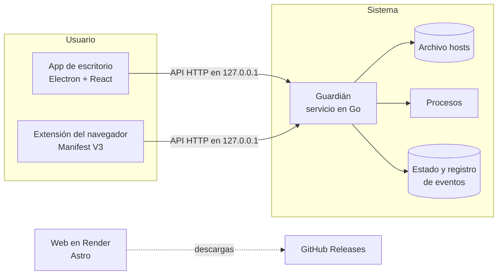

# Céntrate

**Escribe lo que no quieres hacer y Céntrate lo bloquea, aunque cierres la app.**

Céntrate es una app de escritorio gratuita y de código abierto para dejar de procrastinar. Escribes, por ejemplo, _«no veo YouTube en una hora»_ y la app lo bloquea durante ese tiempo. El bloqueo sigue aunque cierres la app, la mates desde el Administrador de tareas o reinicies el ordenador. Cada intento de entrar en algo bloqueado te cuesta puntos.

Además tiene un **Study Mode**: la cámara y una IA que funciona solo en tu ordenador comprueban si estás estudiando. Ninguna imagen sale de tu ordenador.

> Estado: en desarrollo (Fase 0). Mira [`ROADMAP.md`](ROADMAP.md).

## Plataformas

- Windows 10 y 11 (prioridad)
- macOS (Apple Silicon e Intel)
- Linux (Ubuntu y Debian)

## Cómo funciona



- **App de escritorio** (`apps/desktop`): lo que ves. Vive en la bandeja del sistema.
- **Guardián** (`guardian/`): un servicio del sistema que aplica los bloqueos. Por eso funciona con la app cerrada.
- **Extensión** (`apps/extension`): bloquea al instante dentro del navegador y muestra la página de «bloqueado».
- **Web** (`apps/web`): presenta la app y permite descargarla.
- **Compartido** (`packages/shared`): catálogo, parser de frases, reglas de puntos y tokens de diseño.

## Privacidad

Sin cuenta, sin telemetría y funciona sin internet. Las imágenes de la cámara se procesan en tu ordenador y nunca se guardan ni se suben. Más detalles en [`PRIVACY.md`](PRIVACY.md).

## Desarrollo

Requisitos: Node 22 o superior y Go 1.24 o superior.

```bash
npm install          # instala todo el monorepo
npm run lint         # ESLint
npm run typecheck    # TypeScript en todos los paquetes
npm test             # Vitest
npm run test:go      # go vet + go test del guardián
npm run build        # compila la web, la extensión y la app

npm run dev -w apps/desktop   # app de escritorio en modo desarrollo
npm run dev -w apps/web       # web en http://localhost:4321
```

## Licencia

[MIT](LICENSE).
